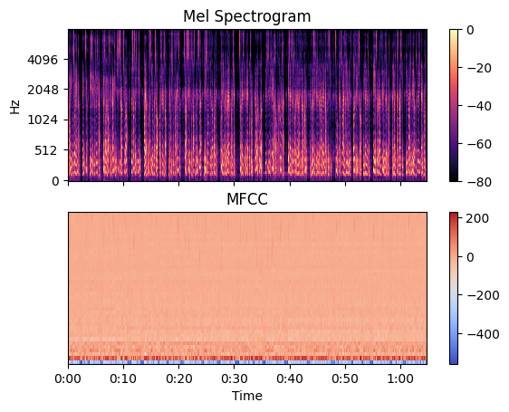
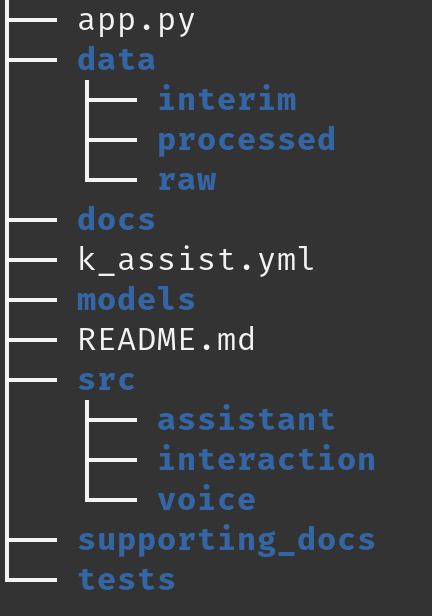

# Kurt 
The creation of an Intelligent Voice Assistant... \
Say "Hi Kurt..."

An intelligent system has the capacity to learn from its environment and directly influence or interact within this 
environment. In order to make Kurt intelligent, we propose the following adaptions to the standard Virtual Assistant (VA)

1. **Voice Recognition** \
Kurt has the capacity to recognize existing user's voices, allowing for user specific information and interactions to occur. 
However, Kurt has the capacity to learn new user identities. If Kurt does not recognize a voice, and that user is not already 
registered, then Kurt will begin learning to recognize their voice, creating a new user profile. Voice samples will be obtained through
a set of setup questions and from further interactions with Kurt.

2. **Calendar Prediction**  \
Kurt learns from your historical calendar entries in order to predict and schedule your week/month/year for you through
your Google calendar. Learning your habits, and schedule in order to take one more task off your hands.

**Note:** Kurt was developed as the Intelligent System Project for the Intelligent Systems course at Maastricht University. 
Thank you to the original Kurt, our professor for use of your name, and for teaching us!

### Attribution
Full acknowledgement and thanks to the below tutorials and videos which enabled us to get a start and create Kurt.
- https://www.youtube.com/watch?v=rf4Us01pvLk 
- https://github.com/Mikael-Codes/ai-assistant
- https://github.com/jurgenarias/Portfolio/blob/master/Voice%20Classification/Code/Speaker_Classifier/Voice_Speaker_Classifier_99.8%25.ipynb

## Users
Kurt is your personal VA, his primary goal is to learn more about you in order to simplify and streamline your daily habits. \
Kurt has basic VA functionality ranging from: 
- Greet/ Repeat : Greet you the user, or repeat what you have said.
- Time: Tell you the current time. 
- Joke: Tell you a joke to brighten your day.
- Search: Kurt performs a Google search opening a results page with the topic of your query.
- Wikipedia: Recite a Wikipedia summary to you, based on your topic of query
- Register: Register a new user
- Exit: Shut down

However, Kurt has much more to offer: \
Kurt has the capability to recognize your voice and automate calendar scheduling. How does this help you? 
This means that your voice has become your biometric password to your calendar access. Despite multiple users within the same household,
Kurt can individually identify who is speaking and make the necessary adjustments to your personal calendar. Additionally, 
Kurt can personalize your interactions.

These capabilities enable the following skills:
- Schedule Description: Describe your schedule
- New Events: Create new events on your command
- Schedule Prediction: Automatically schedule events, based on personal event history available in the your calendar..

### General Use
In order to use Kurt, begin each query with **Hi Kurt** followed by your query.
Kurt is based on freely available voice-to-text API, such that mistakes do happen in the translation of spoken word to text.
Please clearly and slowly enunciate your query for the best chance of Kurt understanding how he can help you. 

### How to set up
Kurt is based on a Conda Virtual Environment, please ensure you have Conda downloaded in order to run Kurt
1. Create the virtual environment for Kurt to run on
   1. In your terminal navigate to the Kurt's directory.
   2. Execute the following `conda env create -f k_assist.yml` in order to generate your virtual environment
   3. Execute `conda activate project_k` in order to activate your virtual environment
2. From your terminal or from your favourite IDE, execute the app.py Python file
   1. Execute from terminal `python app.py`
   2. If from your IDE, ensure that it is using your created virtual environment. PyCharm link [here](https://www.jetbrains.com/help/pycharm/conda-support-creating-conda-virtual-environment.html#conda-requirements)
3. Kurt will greet you, asking how he can help.
   1. Say **Hi Kurt, register new user** and follow the prompts and process he guides you through

### Commands
Each command should be preceded by **Hi Kurt**.
Note command recognition is based on keyword matching. Below is an example command with the keyword highlighted. Following the 
example command is a list of alternative keywords that can be utilized to best fit your natural way of speaking.
- Greet/ Repeat: "Hi Kurt, **say** hello"  [say, greet, repeat]
- Time: "Hi Kurt, what is the **time** now?"  [time]
- Joke: "Hi Kurt, tell me a **joke**" [joke, something funny]
- Search: "Hi Kurt, please **search** Llamas for me"  [search, lookup]
- Wikipedia: "Hi Kurt, **Wikipedia** Europe for me"   [Wikipedia, Summarize]
- Register: "Hi Kurt, **register** a **new** user please' [new, user, register, registration]
- Exit: "Hi Kurt, **quit**, chat next time" [quit, goodbye, exit, leave, finish, end, close, goodnight]
- Schedule description: "Hi Kurt, read **schedule** for _today/ tomorrow/ day_' [what do I have, do I have plans, read schedule]
- New event: "Hi Kurt, schedule _event name_ for _some day_ from _start time_ to _end time_" [book, create, schedule]
- Schedule Prediction: "Hi Kurt, **predict** _event_name_ for _time_frame_" [predict]
  - Event name must be consistent through calendar for event history matching
  - Time frame examples include 'this week' or 'next week'

### Privacy Concerns
Note, Kurt has a passive listening capability when active, meaning that when he is activated Kurt will listen to all conversations
reaching a volume greater than ambient surroundings, this is to enable additional data collection in order to improve the accuracy 
of the voice recognition. He will as such interact with you to potentially clarify who is speaking even if he is not directly addressed. 
This audio is then saved locally in the `data/voice/` folder, with the transcript and other details specified in the `audio_store.csv`
file.

### Disclaimer
The developers or associated persons with the Kurt project are not responsible for data security, or breaches of privacy due to passive listening.
Use of Kurt comes with the user responsibility to manage personal or third-party data collected.
Additionally this project was completed as an assignment but will be made open source for any future development work. 

### How it Works
Kurt's unique abilities originate from his capability to recognize user voices and predict future calendar events.

#### Voice Recognition
The registration process requires you the user to generate 'bootstrap' audio data that allows Kurt to begin learning your voice.
Repeated uses of Kurt will boost this data with Kurt constantly attempting to identify and user, and correcting the process if he is incorrect,
resulting in a dynamic learning process that is scalable to approximately 50 users.

The voice recognition process is based on a Neural Network, requiring an input and a label in order to learn. 
The label is the user's name. The input is a transformed version of the user's audio. 
The audio is transformed through the use of a Mel Spectrogram, which at each point in the audio breaks teh user's voice into 
Mel Bands (A range of 0-128 Mel Bands). For the duration of the audio, Mel-bands are averaged, producing a voice characteristic that can 
be used to train the voice classifier. 

An example of a audio sample transformed into a Mel Spectrogram

A more detailed approach can be found in `notebooks/voice_classification.pynb`
#### Calendar Prediction
The prediction of future calendar events is based on a Random Forest Classifier with 50 trees, and 
a maximum depth of 10 for each tree. 
For each prediction, the classifier is trained using the user's schedule of the previous two months 
with a focus on the event to be predicted.

The prediction is based on six different features that are acquired with basic feature engineering from the dates of the event:
- month
- a calendar day of the month
- working day number
- day of the week
- week of month number
- monthly weekday occurrence (i.e. second Monday of the month)

After predicting whether the event happens on a specific day, the start and duration of the event is 
decided with majority voting based on the event times from the past month for that weekday.

## Developers
This project upon assignment completion will be made open source for future development. 
Collaborators are encouraged. There exists a section of future work which would be exciting to work on.

### Virtual Environment
A Conda virtual environment was used to provide a stable development environment.
Additionally, a requirements.txt file was kept up to date to accommodate other virtual environment setups.
The steps to set up the Conda virtual environment are as follows: 
For information on Conda environments found in `supporting_docs/conda_virtual_env.pdf`. 
*All credit for information in the summary document and further information regarding Conda 
goes to their official site: https://docs.conda.io/en/latest/*

The _k_assist.yml_ file will be utilized to generate the virtual environment titled 'project_k'. \
In order to generate and utilize the virtual environment, perform the following steps:
1. Navigate to the root directory of the project in terminal. 
2. `conda env create -f k_assist.yml`
3. `conda activate project_k`
4. Verify the environment was installed correctly by listing installed packages/ libraries
    - `conda env list`

Modifications to the virtual environment dependencies must be updated in the `k_assist.yml` and `requirements.txt` files.

#### Using Virtual Environment in Pycharm
Pycharm virtual environment setup link [here](https://www.jetbrains.com/help/pycharm/creating-virtual-environment.html#existing-environment)
1. Open IDE Settings through shortcut `ctrl + alt + s`
2. Select project: k_voice_assistant on the left-hand side of the pop-up
   - There exists two modules within this, **Python interpreter** and **project structure**. **Select Python interpreter** 
3. Select **add interpreter** -> **add local interpreter** -> **conda environment**
4. Ensure **existing environment** is selected. 
5. Select **project_k** from the dropdown menu

### Project Structure
The project structure is designed to enable standard application development, model creation, and notebook exploration and documentation.
Below is a snapshot of the base project file structure.
****

### Future Work
Future work revolves largely around Kurt's unique features, specifically the voice classification and calendar prediction.
This list is not extensive and serves as a place to generate ideas. 

- Improve Voice Classification
  - Kurt currently makes use of only Mel Spectrograms to create an input feature to the network. 
  - To improve user specificity and the number of users Kurt can recognize the following methods are advised to be appended to the feature vector (based on previous work [here](https://github.com/jurgenarias/Portfolio/blob/master/Voice%20Classification/Code/Speaker_Classifier/Voice_Speaker_Classifier_99.8%25.ipynb)).
    - Mel Frequency Cepstral Coefficients (MFCCs)
    - Short-Time-Fourier-Transform (STFT)
    - Chromagram
    - Spectral Contrast
    - Tonal Centroid Features
  - The above features were successfully implemented in https://github.com/jurgenarias/Portfolio/blob/master/Voice%20Classification. Thank you for your clear documentation and great work!

### Limitations
Kurt makes use of speech_recognition library which is sensitive to ambient noise, and may often miss-hear spoken words, creating 
an incorrect and often funny transcript. However, clear enunciation and a quite background, allows very good performance from this package.

### Possible Issues
- **espeak module not installed**
  - Linux fix: `sudo apt-get install python-espeak` 
  - Pip fix: `pip install python-espeak`
- **Py Audio Issue**
  - Issues with PyAudio no being installed with environment. 
  - Execute `pip install pyaudio` when conda environment activated to install it
  - Alternatively if on Mac, execute `brew install portaudio`

### Existing Development Accounts
An existing Google account can be used for testing purposes for developers, the login details are as follows:
- Email: intellikurt@gmail.com
- Password: IntelligentSystems
- Birthday: 1 January 2000

### Documentation
[Sphinx Documents](https://www.sphinx-doc.org/en/master/) allows for comprehensive documentation of the methods and
 packages for Kurt.

To display current documentation:
1. Navigate in terminal to the project directory -> `docs`
2. Launch docs using your favourite browser as follows: `$ firefox build/html/index.html` or simply open the `index.html
 page

To update the docs:
1. In terminal access the docs directory `cd docs`
2. If you have added any additional files in any directory, run the respective command below:
   - `sphinx-apidoc -o ./source ../src/calendar/`
   - `sphinx-apidoc -o ./source ../src/voice/`
   - `sphinx-apidoc -o ./source ../src/assistant/`
3. If you have already generated HTML pages previously run `make clean`
4. Run `make html`
5. Launch docs in your selected browser (here it is firefox) `firefox build/html/index.html`

### How to get Started
Due to biometric privacy concerns the recorded audio data of **Unknown** individuals has been removed. This was provided willingly during the project course,
however when release as open source this has been removed to limit biometric exposure. 

As such an alternative source of **Unknown** speaker data will need to be sourced. 
However, at the start the model will contain the training and still be able to identify unknown users. 

### Important Note
Kurt re-structures the Neural Network final layer each time a new user is added to include the user in the softmax output. 
Additionally, if Kurt identifies a new audio sample has been added and approximately a day has passed, he will retrain the model. 
The model re-structuring and training will remove all previous training. It is essential the **Unknown** users be replaced before training. 

Please get in touch if there are any questions/ issues/ bugs, we look forward to seeing how this project will develop in the future.
